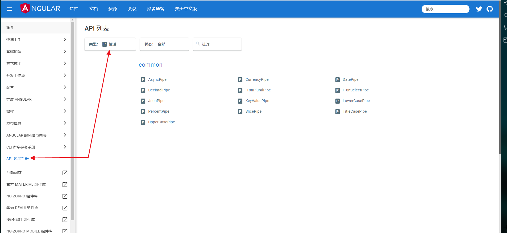

## 管道(|)
> 管道可以理解为把模板上的值丢进一条或多条管道，经过管道的处理输出一条新的值

```typescript
import {Component} from '@angular/core';
@Component({
  selector: 'app-tpl-var',
  template: `
    <p>Title through uppercase pipe: {{title | uppercase}}</p>
    <p>Title through uppercase pipe: {{title | uppercase | lowercase}}</p>
    <p>json: {{ obj | json }}</p>
  `,
})
export class TplOperatorsComponent {
  title = 'aBc';
  obj = {
      name: 'aaa',
      time: '1980-02-25T05:00:00.000Z',
      price: '$333'
    };
  constructor() {}
}
```
### 带参数的管道
**如内置的[date管道](https://angular.cn/api/common/DatePipe)**
```typescript
import {Component} from '@angular/core';
@Component({
  selector: 'app-tpl-var',
  template: `
    <p>Manufacture date with date format pipe: {{now | date:'longDate'}}</p>
    <p>Manufacture date with date format pipe: {{now | date:'yyyy-MM-dd'}}</p>
  `,
})
export class TplOperatorsComponent {
  now = Date.now();
  constructor() {}
}
```

### 所有内置管道



## 安全导航运算符(?)
> 安全导航运算符是 es2020 中的新语法，又叫可选链

```typescript
import {Component} from '@angular/core';
@Component({
  selector: 'app-tpl-var',
  template: `
    <!--<p *ngIf="hero">hero: {{ hero.name }}</p>-->
    <p>hero: {{ hero?.name }}</p>
  `,
})
export class TplOperatorsComponent {
   hero: Hero;
    constructor() {
      setTimeout(() => {
        this.hero = {
          id: 'hero_00',
          name: '龙龟'
        };
      }, 2000);
    }
}
```


## 非空断言(!)
> 在ts中，开启--strictNullChecks后，将一个可能是undefined或null的变量赋给一个有确切类型的变量时，会报错
<br>
但在特定情况下，我们很确定那个变量一定不是undefined或null，这个时候就可以用非空断言操作符
<br>
用了这个操作符的变量，可以理解为叫ts不要去操心了，我这个变量一定是有值的
非空断言生效的前提是开启 --strictNullChecks

**使用非空断言的两个步骤：**
- tsconfig.json中设置"strictNullChecks": true,
- tslint.json中设置 "no-non-null-assertion": false

```typescript
import {Component} from '@angular/core';
@Component({
  selector: 'app-tpl-var',
  template: `
    <input #phone placeholder="phone number" />
    <button (click)="callPhone(phone.value)">Call</button>
  `,
})
export class TplOperatorsComponent {
  name: string | null = '';
  constructor() {
    // 报错，this.name可能为null, 不能赋给heroName
    const heroName: string = this.name;
    
    // 不报错，告诉ts，this.name一定不是null
    const heroName: string = this.name!;
    
    // 以上写法相当于
    if (this.name) {
      const heroName: string = this.name;
    }
  }
}
```


## 类型转换函数 $any()
有时候，绑定的表达式不能或很难指定类型。要消除这种报错，你可以使用 $any() 转换函数来把表达式转换成 any 类型
<br>
假设无法确定item的类型，也就不能确定item是否有bestByDate，这时就会报错，可以用$any()把item视为any类型，避免其报错
```angular2html
<p>The item's undeclared best by date is: {{$any(item).bestByDate}}</p>
```

也可以用这个函数绑定组件中不存在的变量
```angular2html
<p>The item's undeclared best by date is: {{$any(this).bestByDate}}</p>
```
